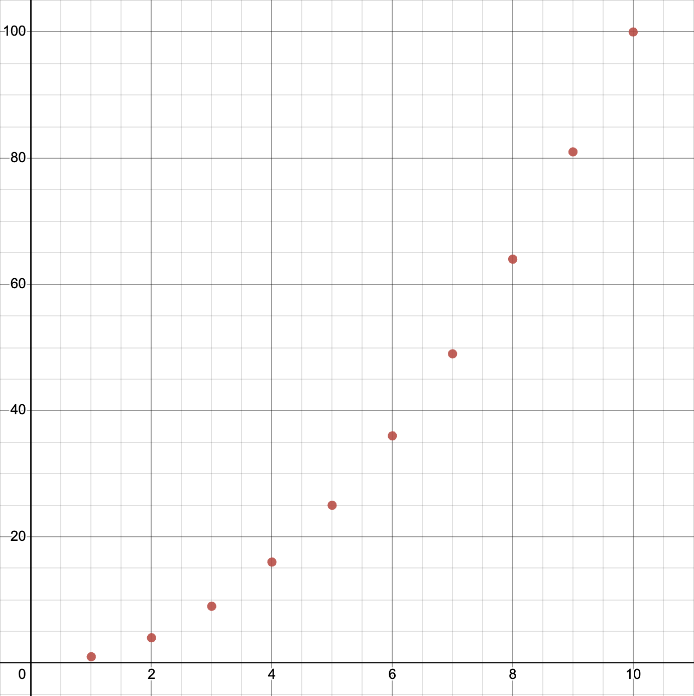

### Describing functions
Functions are abstract mathematical objects, but when we want to talk about them, we need to represent them.
**There are 3 main ways to describe, or represent, a function:**
1. Equation
2. Graph
3. Map
4. Table

#### Equation
The most standard way of representing a discrete function is using its equation. In this example, the function being described will be:

$ f(x) = x^{2}$

#### Graphical representation
In normal math, functions are continuous, so an equation looks like a line when graphed. However, because in discrete math the numbers in the domain are each a set distance apart, functions appear as dots:

$f(x)$

#### Mapping diagram
In normal math, functions can also be represented using a table. When functions are discrete, on the other hand, since one input clearly leads to one output, the relation is represented via arrows:

$ f(x) \\$
$ x \rightarrow y \\$
$ 1 \rightarrow 1 \\$
$ 2 \rightarrow 4 \\$
$ 3 \rightarrow 9 \\$
$ 4 \rightarrow 16 \\$
$ 5 \rightarrow 25 \\$
$ 6 \rightarrow 36 \\$
$ 7 \rightarrow 49 \\$
$ 8 \rightarrow 64 \\$
$ 9 \rightarrow 81 \\$
$ 10 \rightarrow 100 \\$

Arrow diagrams are useful because they can aid in visualizing a function.

#### Table

However, these functions can also be depicted using a table of inputs and outputs, similar to in normal math:

| $x$   | $f(x)$|
| ------| ------|
| 1     | 1     |
| 2     | 4     |
| 3     | 9     |
| 4     | 16    |
| 5     | 25    |
| 6     | 36    |
| 7     | 49    |
| 8     | 64    |
| 9     | 81    |
| 10    | 100   |

Tables are useful because they emphasize the input-output relationship that characterizes a function.

Tables can be further simplified into matricies, like shown below: 

$$
f\begin{pmatrix}
1 & 2 & 3 & 4 & 5 & 6 & 7 & 8 & 9 & 10 \\
1 & 4 & 9 & 16 & 25 & 36 & 49 & 64 & 81 & 100
\end{pmatrix}
$$

The advantage of such a notation is that it is more compact and easy to write that making an entire table or drawing an entire graph. Such a notation also makes it harder to accidentally define more than one output for a single input.

For example, can you tell which one of these relations is a function?
(let the domain $X = \{1,2,3,4\}$ and the range $Y = \{a,b,c,d\}$)

$$
s: X \rightarrow Y \\
s\begin{pmatrix}
1 & 2 & 3 & 4 \\
d & a & c & b
\end{pmatrix}
$$

$$
g: X \rightarrow Y \\
g\begin{pmatrix}
1 & 2 & 3 & 4 \\
d & a & a & b
\end{pmatrix}
$$

$$
h: X \rightarrow Y \\
h\begin{pmatrix}
2 & 2 & 3 & 4 \\
c & a & d & b
\end{pmatrix}
$$

The answer is that $f$ and $g$ are functions. This is because in both these relations, each value in the domain has only one value in the range assigned to it. $h$, on the other hand, is *not* a function because in it the domain value of 2 is assigned the values $c$ and $a$ in the range.

#### Sources
1. [https://discrete.openmathbooks.org/dmoi3/sec_intro-functions.html](https://discrete.openmathbooks.org/dmoi3/sec_intro-functions.html)

2. [https://flexbooks.ck12.org/cbook/ck-12-basic-algebra-concepts/section/1.13/related/lesson/different-representations-of-functions-msm8-ccss/](https://flexbooks.ck12.org/cbook/ck-12-basic-algebra-concepts/section/1.13/related/lesson/different-representations-of-functions-msm8-ccss/)

Next part of the presentation by [Anfal](https://github.com/Egamer512/csc208/blob/main/CH%200.4%20/Chapter_0.4_Presentation_(43-45).md).