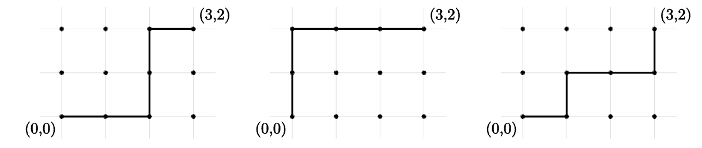

# Chapter 1: Counting

## 1.1 Addative and Multiplicative Principles

### Addative principle

Supose that at the restaurant Red Dogs and Donuts, there are 14 varieties of donuts and 16 varieties of hot dogs. If you want either a donut or a dog, how many options do you have?

The solution is easy; just add 14 and 16. This problem is an example of the **addative principle**:

The **addative principle** states that if even $A$ can occur in $m$ ways, and even $B$ can occur in $n$ *disjoint* ways, then the event "$A$ or $B$" can occur in $m + n$ different ways.

In this case, event $A$ is picking a hotdog at random. There are 14 ways that this can take place. Event $B$ entails picking a donut at random. If you pick either a hotdog or a donut at random, there are 30  items you could possibly end up with.

Note that for the addative principle to work, events $A$ and $B$ have to be *disjoint*, i.e. it should be impossible for both events to take place at the same time.

### Multiplicative Principle

Suppose that you are going to have some fro-yo. You can pick one of 6 yogurt choices along with one of 4 toppings. How many choices do you have in total?

Using the addative principle and considering each of the 6 yogurt choices to be a seperate event with 4 possiblilties, we can add $6+6+6+6=24$. However, it is much easier to multiply $6*4$. This is an example of the **multiplicative principle**:

The **multiplicative principle** states that if event $A$ can occur in $m$ ways, and each possibility for $A$ allows for exactly $n$ ways for event $B$, then the event "$A$ and $B$" can occur in $m*n$ ways.

### Counting With Sets

So far, we have described events using numbers that describe all possible occurences of those events. However, it is also possible to represent events as sets. Here is an example:

Suppose you have 9 shirts and 5 pairs of pants. How many outfits can you possibly wear? Using the multiplicative principle, we can multiply $9*5$ to get $45$. Now, let's use sets instead. The set $X$ contains all possible shirts, so $|X|=9$. The set $Y$ contains all possible pairs of pants, so $|Y|=5$. Then, we can do $|X|*|Y|=45$.

On the other hand, suppose you have to pick one article of clothing at random. This time, we can use the addative principle to do $|X|+|Y|=14$.

The **addative principle (with sets)** states that given two sets $A$ and $B$, if $A \cap B = \emptyset$ (i.e. $A$ and $B$ have no elements in common), then $A \cup B = |A| + |B|$.

For the multiplicative principle, on the other hand, we have to represent "$A$ and $B$" as ordered pairs of $(x,y)$. Doing so, we get the following rule:

The **cartesian product** states that given sets $A$ and $B$, we can form the set $A * B = {(x,y):x \in A \land y \in B}$.

The **multiplicative principle (with sets)** states that given two sets $A$ and $B$, we have $|A*B| = |A|*|B|$.

### Addative Principle with overlapping sets

Suppose we want to find $|A \cup B|$ and we know that $|A| = 20$ and $|B| = 15$. We also know that the two sets are *not* disjoint, and that $|A \cap B| = 5$. Using basic subraction, we can deduce that $|A \backslash B| = 20 - 5 = 15$ and that $|B \backslash A| = 15 - 5 = 10$. If we just use the normal addative principle, we get $|A| + |B| = 20 + 15 = 35$. However, this means that we are 5 off from the answer. This disparity gives us the **cardinality of a union**:

The **cardinality of union (using 2 sets)** states that for any finite sets $A$ and $B$, $|A \cup B| = |A| + |B| - |A \cap B|$.

This principle can also be applied to 3 sets:

The **cardinality of union (using 3 sets)** states that for any finite sets $A$, $B$ and $C$, $|A \cup B \cup C| = |A| + |B| + |C| - |A \cap B| - |A \cap C| - |B \cap C| + |A \cap B \cap C|$.

## 1.2 Binomial Coefficients

### Bit Strings

A **bit string** is a string of binary digits:

$10000000100110$

The number of bits in the string is called the **length** of the string, and the number of 1s in the string is called the **weight** of the string. The length of the bit string above is 14, and its weight is 4.

$B^n$ is the set of all n-bit strings, and $B^n_k$ is the set of all n-bit strings with weight k.

So, $B^3_2$ is a set containing the strings 011, 101 and 110.

### Lattice Paths

The **integer lattice** is the set of all points in the Cartesian plane for which both the $x$ and $y$ coordinates are integers.

A **lattice path** is one of the shortest possible paths connecting 2 points on the lattice, moving only horizontally and vertically.

For example, here is an image showing all possible lattice paths between the points $(0,0)$ and $(3,2)$ on the integer lattice:

### Binomial Coefficients

**Binomial coefficients** are the coefficients in the expanded version of a binomial, such as $(x+y)^5$.

$$
(x+y)^5=x^5+5x^4y+10x^3y^2+10x^2y^3+5xy^4+y^5
$$

These numbers are similar to lattice paths and bit strings, so we will call them **binomial coefficients**. The have a special notation: $(^n_k)$

For each integer $n \ge 0$ and integer $k$ with $0 \le k \le n$ there is a number $(^n_k)$ read "n choose k" such that:

1. $(^n_k) = |B^n_k|$, the number of $n$-bit strings of weight $k$.
2. $(^n_k)$ is the number of subsents of a set of size $n$ each with cadinality $k$.
3. $(^n_k)$ is the number of lattice pathes of length $n$ containing $k$ steps to the right.
4. $(^n_k)$ is the coefficient of $x^ky^{n-k}$ in the expantion of $(x+y)^n$.
5. $(^n_k)$ is the number of ways to select $k$ objects from a total of $n$ objects.

### Recurrence Relation

The **recurrence relation** states that $(^n_k) = (^{n-1}_{k-1})+(^{n-1}_k)$.
