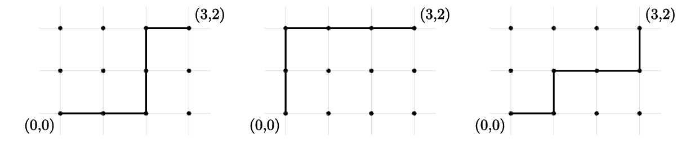

# 1.2 Binomial Coefficients

## Bit Strings

A **bit string** is a string of binary digits:

$10000000100110$

The number of bits in the string is called the **length** of the string, and the number of 1s in the string is called the **weight** of the string. The length of the bit string above is 14, and its weight is 4.

$B^n$ is the set of all n-bit strings, and $B^n_k$ is the set of all n-bit strings with weight k.

So, $B^3_2$ is a set containing the strings 011, 101 and 110.

## Lattice Paths

The **integer lattice** is the set of all points in the Cartesian plane for which both the $x$ and $y$ coordinates are integers.

A **lattice path** is one of the shortest possible paths connecting 2 points on the lattice, moving only horizontally and vertically.

For example, here is an image showing all possible lattice paths between the points $(0,0)$ and $(3,2)$ on the integer lattice:

Lattice paths are similar to bit strings in that just as bit strings can only have 1s and 0s, lattice paths can only progress right or up.

## Binomial Coefficients

**Binomial coefficients** are the coefficients in the expanded version of a binomial, such as $(x+y)^5$.

$$
(x+y)^5=x^5+5x^4y+10x^3y^2+10x^2y^3+5xy^4+y^5
$$

These numbers are similar to lattice paths and bit strings, so we will call them **binomial coefficients**. The have a special notation: ${{n} \choose {k}}$

For each integer $n \ge 0$ and integer $k$ with $0 \le k \le n$ there is a number ${{n} \choose {k}}$ read "n choose k" such that:

1. ${{n} \choose {k}} = |B^n_k|$, the number of $n$-bit strings of weight $k$.
2. ${{n} \choose {k}}$ is the number of subsents of a set of size $n$ each with cadinality $k$.
3. ${{n} \choose {k}}$ is the number of lattice pathes of length $n$ containing $k$ steps to the right.
4. ${{n} \choose {k}}$ is the coefficient of $x^ky^{n-k}$ in the expantion of $(x+y)^n$.
5. ${{n} \choose {k}}$ is the number of ways to select $k$ objects from a total of $n$ objects.

## Recurrence Relation

The **recurrence relation** states that
${{n} \choose {k}} = {{n-1} \choose{k-1}}+{{n-1} \choose {k}}$.
