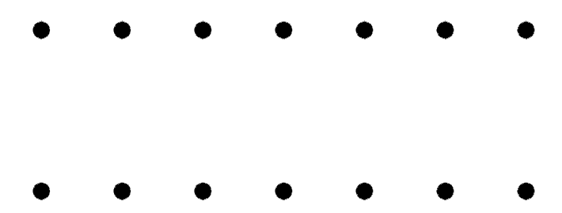

# Section 1.3 Exercises

## Problem 1

A pizza parlor offers 10 toppings.

1. How many 3-topping pizzas could they put on their menu? Assume double toppings are not allowed.

2. How many total pizzas are possible, with between zero and ten toppings (but not double toppings) allowed?

3. The pizza parlor will list the 10 toppings in two equal-sized columns on their menu. How many ways can they arrange the toppings in the left column?

**Solution to part 1:** ${10 \choose 3} = \frac{10!}{(10-3)!3!} = 120$ 3-topping pizzas.

**Solution to part 2:** If we take each topping to be a choice of yes or no of whether we want that topping in the pizza or not, that's 10 choices with 2 options each for a total of $2^10 = 1024$ possible pizzas.

**Solution to part 3:**This question is asking for all the different ways to arrange 5 toppings. That's $5! = 120$ different ways.

## Problem 3

Using the digits 2 through 8, find the number of different 5-digit numbers such that:

1. Digits can be used more than once.

2. Digits cannot be repeated, but can come in any order.

3. Digits cannot be repeated and must be written in increasing order.

4. Which of the above counting questions is a combination and which is a permutation? Explain why this makes sense.

**Solution to part 1:** We are given the digits ${2,3,4,5,6,7,8}$ and asked to select 5 of them. If digits can repeat, that gives us 7 options 5 times, which means there are $7^5 = 16,807$ different 5-digit numbers.

**Solution to part 2:** This is simply a permutation, or ${7 \choose 5} * 5! = 2,520$ 5-digit numbers.

## Problem 5

Suppose you wanted to draw a quadrilateral using the dots below as vertices (corners). The dots are spaced one unit apart horizontally and two units apart vertically.

1. How many quadrilaterals are possible?
2. How many are squares?
3. How many are rectangles?
4. How many are parallelograms?
5. How many are trapezoids? (Here, as in calculus, a trapezoid is defined as a quadrilateral with at least one pair of parallel sides. In particular, parallelograms are trapezoids.)
6. How many are trapezoids that are not parallelograms?

**Solution to part 1:** A quadrilateral is any combination of 4 dots, 2 of which are on one line and 2 of which are on the other. This is the minimum requirement for a quadrilateral. So, we can take all the possible selection of 2 dots from each line and multiply them to get all possible quadrilaterals using the multiplicative principle:

$$
{7 \choose 2} * {7 \choose 2} = 21^2 = 441
$$

There are $441$ quadrilaterals possible.

**Solution to part 2:** The number of squares can be found by selecting pairs of dots on the top line that each have one dot in between. Each of these pairs lines up with another pair on the bottom line, and ensuring that there is one dot between each pair makes it so that the horizontal distance between the pairs equals the vertical distance. There are $5$ such pairs that can be selected on the top line (which can just be counted by looking at the picture), so that gives us $5$ possible squares with the given dots.

**Solution to part 3:** Rectangles are just squares without the restriction of the pairs of dots needing one dot in between. Here, we just need all the ways to select 2 dots on the top row. This can be found using ${7 \choose 2}$ again, which gives us $45$ possible rectangles.

**Solution to part 4:** Parallelograms are like rectangles in that they involve selecting all kinds of pairs on the top row. However, they also involve selecting equally distant pairs on the bottom row. This means that using the multiplicative principle, we can square each of the pairs that are a certain distance apart. There are 6 ways to select pairs of dots that are next to each other, 5 ways to select pairs of dots that each have one dot in between, 4 ways to select pairs that have 2 dots in between, and so on until there is 1 way to select a pair of dots with 5 dots in between. These pairs give us our final equation:

$$
6^2 + 5^2 + 4^2 + 3^2 + 2^2 + 1^2 = 36 + 25 + 16 + 9 + 4 + 1 = 91
$$

There are $91$ parallelograms we can select.

**Solution to part 5:** According to the question, a trapezoid is any quadrilateral with at least one pair of parallel sides. In this case, any quadrilateral that gets selected, any group of 4 dots, is always going to be a trapezoid, because the lines of dots are parallel and therefore the top and bottom sides will be parallel. So, we can answer part 5 the same way we answered part 1:

$$
{7 \choose 2} * {7 \choose 2} = 441
$$

There are $441$ different trapezoids.

**Solution to part 6:** To find all trapezoids that are not parallelograms, we just have to subtract the number of possible parallelograms from the number of possible trapezoids. This gives us $441 - 91 = 350$ possible trapezoids that are not parallelograms.

## Problem 6

How many triangles are there with vertices from the points shown below? Note, we are not allowing degenerate triangles - ones with all three vertices on the same line, but we do allow non-right triangles. Explain why your answer is correct.

Let's say that group 1 of dots is the entire row of 7 dots spanning the bottom of the image, and group 2 of dots is the column of 4 dots that runs from the top of the picture all the way to where it ends near the bottom row. To make triangles, we can find all ways to select 2 dots from group 1 and multiply that by the number of ways to select 1 dot from group 2. This gives us the following equation:

$$
{7 \choose 2} * {4 \choose 1} = 21 * 4 = 84
$$

Then, we have to make one adjustment: let's say that group 1 now just has 6 dots in it, because we subtracted the one dot in the corner. group 2 will stay the same. Now, we can find all of the possible ways to select one vertex from group 1 and TWO vertices from group 2. This gives us the following equation:

$$
{6 \choose 1} * {4 \choose 2} = 6 * 6 = 36
$$

So that means that there are $84 + 36 = 120$ possible triangles.

## Problem 7

An *anagram* of a word is just a rearrangement of its letters. How many different anagrams of “uncopyrightable” are there? (This happens to be the longest common English word without any repeated letters.)

The word "uncopyrightable" has 15 letters in it, which means that there are $15! = 1,307,674,368,000$ ways to arrange its letters.

## Problem 8

How many anagrams are there of the word “assesses” that start with the letter “a”?

The word “assesses” has 8 letters in it. The letter a is given as the start, so we just have to find all the ways to arrange the remaining 7 letters. Of these 7 letters, 5 of them are Ss and 2 of them are Es. So, we have to divide the total number of ways to arrange the letters by the number of ways to arrange each repeat. This gives us the following equation:

$$
\frac{7!}{5!*2!} = \frac{5,040}{120*4} = 10.5
$$

We round down because there can't be half an arrangement, so that means that there are 10 different angrams of the word "assesses" with a as the first letter of each.
