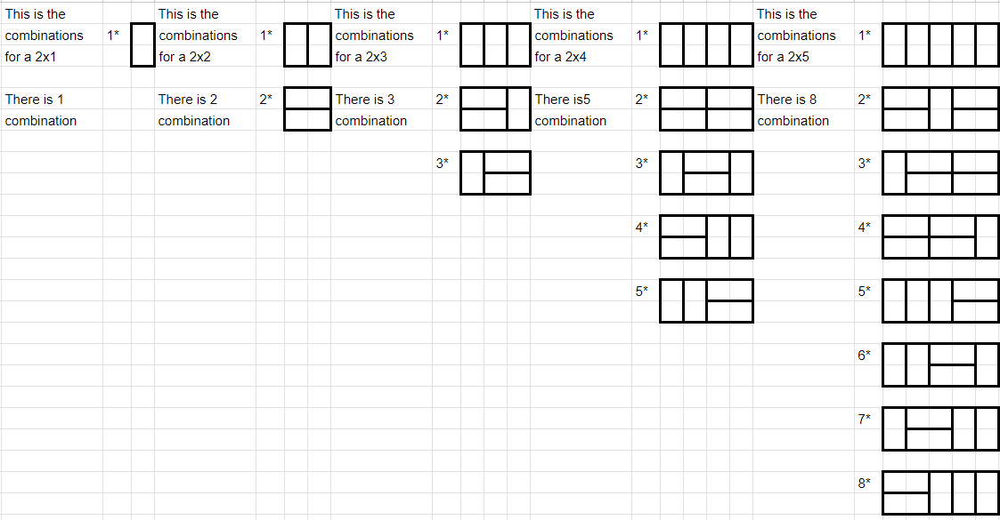

# Problem 2.1.19

## Question

Let $t_n$ denote the number of ways to tile a $2 \times n$ chessboard using $1 \times 2$ dominoes. Write out the first few terms of the sequence $(t_n)_{n \ge 1}$ and then give a recursive definition. Explain why your recursive formula is correct.
**Hint:** There is only one way to tile a $2 \times 1$ board, and two ways to tile a $2 \times 2$ board (you can orient the dominoes in two ways). In general, consider the two ways the domino covering the top left corner could be oriented.

## Solution

Counting the ways to tile $1 \times 2$, $2 \times 2$, $3 \times 2$ and $4 \times 2$ boards is easy and can be done by hand. When we count the number of ways to tile each of these boards, we get the following:

Looking at these terms in the sequence, we start to see a pattern: A term in the sequence is equal to the sum of the previous two terms, with the first term being $1$ and the second one being $2$. We identified this as the Fibonacci sequence, which is the following, $1, 1, 2, 3, 5, 8, 13$.

Writing this in mathematical terms, we get the following:

$$
t_n = t_{n-1} + t_{n-2}
$$

$$
t_0 = 1, t_1 = 2
$$
