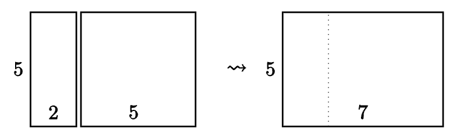

# Section 2.2 Exercises

## Problem 1

Consider the sequence $5,9,13,17,21,...$ with $a_1 = 5$.

1. Give the recursive definition for the sequence.
2. Give a closed formula for the $n$th term of the sequence.
3. Is 2013 a term in the sequence? Explain.
4. How many terms does the sequence $5,9,13,17,21,...,533$ have?
5. Find the sum: $5+9+13+17+21+ \cdot +533$ Show your work.
6. Use what you found above to find $b_n$, the $n$ th term of $1,6,15,28,45,...$, where $b_0 = 1$.

**Part 1:** $a_n = a_{n-1} + 4$ with $a_0 = 5$.

**Part 2:** $a_n = 5 + 2n$.

**Part 3:** If 2013 is a term, the following equation should result in a whole solution when solved:

$$
\begin{align*}
    5 + 2n &= 2013 \\
    2n &= 2018 \\
    n &= 1009 \\
\end{align*}
$$

The equation has a whole solution, therefore 2013 is the 2009th term in the sequence.

**Part 4:** 533 is the $n$ th term of the sequence, so we have to solve for $n$:

$$
\begin{align*}
    5 + 2n &= 533 \\
    2n &= 528 \\
    n &= 264 \\
\end{align*}
$$

**Part 5:** Sum of an arithmetic sequence:

$$
\begin{array}{cccccccccc}
    & S & = & 5 & + & 9 & + & 13 & ... & + & 529 & + & 533 \\
    + & S & = & 533 & + & 529 & + & 525 & ... & + & 9 & + & 5 \\
    \hline
    & 2S & = & 538 & + & 538 & + & 538 & ... & + & 538 & + & 538 \\
\end{array} \\
$$

$$
\begin{align*}
    5 + 4n &= 533 \\
    4n &= 528 \\
    n &= 132 \\
\end{align*} \\
$$

$$
\therefore 2S = 538 * 133 = 71,554 \\
S = 35777
$$

**Part 6:** $b_n = 1 + \frac{(4n + 6)n}{2}$.

## Problem 2

Consider the sequence $(a_n)_{n \ge 0}$ which starts $8,14,20,26,...$.

1. What is the next term in the sequence?
2. Find a formula for the $n$ th term of this sequence.
3. Find the sum of the first 100 terms of the sequence: $\sum_{k=1}^{99}a_k$.

**Part 1:** $32$.

**Part 2:** $a_n = 8 + 6n$.

**Part 3:**

$$
\begin{align*}
    a_{99} &= 8 + 6(99) \\
    a_{99} &= 8 + 594 \\
    a_{99} &= 602
\end{align*}
$$

$$
\begin{array}{cccccccccc}
    & S & = & 8 & + & 14 & + & 20 & ... & + & 596 & + & 602 \\
    + & S & = & 602 & + & 596 & + & 590 & ... & + & 14 & + & 8 \\
    \hline
    & 2S & = & 538 & + & 538 & + & 538 & ... & + & 538 & + & 538 \\
\end{array} \\
$$

$$
\therefore 2S = 538 * 100 = 53800
S = 26,900
$$

## Problem 3

Consider the sum $4 + 11 + 18 + 25 + \cdots + 249$.

1. How many terms (summands) are in the sum?
2. Compute the sum using a technique discussed in this section.

**Part 1:**

$$
\begin{align*}
    a_n &= 4 + 7n \\
    249 &= 4 + 7n \\
    7n &= 245
    n &= 35
\end{align*}
$$

$n$ starts from 0, therefore there are 36 summands.

**Part 2:**

$$
\begin{array}{cccccccccc}
    & S & = & 4 & + & 11 & + & 18 & ... & + & 242 & + & 249 \\
    + & S & = & 249 & + & 242 & + & 235 & ... & + & 11 & + & 4 \\
    \hline
    & 2S & = & 253 & + & 253 & + & 253 & ... & + & 253 & + & 253 \\
\end{array} \\
$$

$$
\therefore 2S = 253 * 36 = 9108 \\
S = 4,554
$$

## Problem 4

Consider the sequence $1, 7, 13, 19, ..., 6n+7$.

1. How many terms are in the sequence? Your answer will be in terms of $n$.
2. What is the second-to-last term?
3. Find the sum of all the terms in the sequence, in terms of $n$.

**Part 1:** $n+2$ terms. To get 1 as the first term of the sequence using the closed formula, we have to plug in -1. Therefore, $n$ starts counting at -1, so there are $n+2$ terms in total if you include $n=0$ and $n=-1$.

**Part 2:** $6n+7-6$, which is equal to $6n+1$.

**Part 3:**

$$
\begin{align*}
    S &= \frac{n(a_1+a_n)}{2} \\
    S &= \frac{(n+2)(1+6n+7)}{2} \\
    S &= \frac{(n+2)(6n+8)}{2} \\
    S &= \frac{2(n+2)(3n+4)}{2} \\
    S &= (n+2)(3n+4) \\
    S &= 3n^2+4n+6n+8 \\
    S &= 3n^2+10n+8 \\
\end{align*}
$$

## Problem 5

Find $5+7+9+11+ \cdots +521$ using a technique from this section.

Closed formula: $a_n = 5 + 2n$

$$
\begin{align*}
    5 + 2n &= 521 \\
    2n &= 516 \\
    n &= 258 \\
\end{align*}
$$

Because $a_0 = 5+2(0)$, $n$ starts counting at 0, so there are 259 terms in the sequence. Now, we can calculate the sum:

$$
\begin{align*}
    S &= \frac{n(a_1+a_n)}{2} \\
    S &= \frac{259(5+521)}{2} \\
    S &= \frac{259(526)}{2} \\
    S &= 259(263) \\
    S &= 68117 \\
\end{align*}
$$

## Problem 6

Find $5+15+45+ \cdots +5*3^{20}$

We can perform the sum:

$$
\begin{array}{cccccccccc}
    & S & = & 5 & + & 15 & + & 45 & + & 135 & ... & + & 5*3^{20}   \\
    - & 3S & = &   &   & 15 & + & 45 & + & 135 & ... & + & 5*3^{20} & + & 5*3^{21} \\
    \hline
    & -2S & = & 5 & + & 0 & + & 0 & + & 0 & ... & + & 0 & - & 5*3^{21}\\
\end{array} \\
$$

$$
\begin{align*}
    -2S &= 5 - 5 * 3^{21} \\
    -2S &= −17433922000 \\
    S &= 8716961000 \\
\end{align*}
$$

## Problem 7

Find $1 - \frac{2}{3} + \frac{4}{9} - \cdots + \frac{2^{30}}{3^{30}}$.

$S + \frac{2}{3}S$ cancels out to $1 + \frac{2^{31}}{3^{31}}$. $\frac{5}{3}S = 1 + \frac{2^{31}}{3^{31}}$, therefore $S = \frac{3(1 + \frac{2^{31}}{3^{31}})}{5}$.

## Problem 12

Starting with any rectangle, we can create a new, larger rectangle by attaching a square to the longer side. For example, if we start with a $2 \times 5$ rectangle, we would glue on a $5 \times 5$ square, forming a $5 \times 7$ rectangle:

The next rectangle would be formed by attaching a $7 \times 7$ square to the top or bottom of the $5 \times 7$ rectangle.

1. Create a sequence of rectangles using this rule starting with a $1 \times 2$ rectangle. Then write out the sequence of perimeters for the rectangles (the first term of the sequence would be 6, since the perimeter of a $1 \times 2$ rectangle is 6 - the next term would be 10).
2. Repeat the above part this time starting with a $1 \times 3$ rectangle.
3. Find recursive formulas for each of the sequences of perimeters you found in parts (1) and (2). Don't forget to give the initial conditions as well.
4. Are the sequences arithmetic? Geometric? If not, are they close to being either of these (i.e., are the differences or ratios almost constant)? Explain.

**Part 1:** The sequence is $6, 10, 16, 26, 42, ...$.

**Part 2:** The sequence is $8, 14, 22, 36, 58, ...$.

**Part 3:** For part (1), the recursive formula is $a_n = a_{n-1} + a_{n-2}$ with $a_0 = 6$ and $a_1 = 10$. For part (2), the recursive formula is $a_n = a_{n-1} + a_{n-2}$ with $a_0 = 8$ and $a_1 = 14$.

**Part 4:** The sequences add pairs of terms to get the next terms. They progress arithmetically, but there is no common difference between them.
