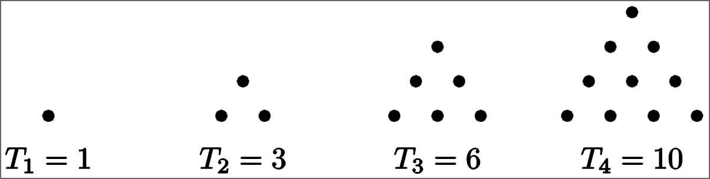

# 2.2 Arithmetic and Geometric Sequences

This section is about finding the closed formulas for certain kinds of sequences.

## Arithmetic Sequences

If the terms of a sequence differ by a constant, we say the sequence is **arithmetic**. If the initial term ($a_0) of the sequence is $a$ and the **common difference** is $d$, the we have the following formulas:

**Recursive definition:** $a_n = a_{n-1} + d$ with $a_0 = a$.

**Closed formula:** $a_n = a + dn$.

## Geometric Sequences

A sequence is called **geometric** if the ratio between successive terms is constant. Suppose the initial term $a_0$ is $a$ and the **common ratio** is $r$. Then we have the following formulas:

**Recursive definition:** $a_n = 4a_{n-1}$ with $a_0 = a$

**Closed formula:** $a_n = a \cdot r^n$.

## Sums of Arithmetic and Geometric Sequences

Let's look at the sequence $(T_n)_{n \ge 1}$ which starte $1, 3, 6, 10, 15, ...$. These are the **triangular numbers** because each number represents the number of dots needed to form a full equilateral triangle:

These numbers do not form an arithmetic sequence. Their differences, however, do: $2,3,4,5,6,...$. This means that the $n$th term of the sequence $(T_n)$ is the sum of the first $n$ terms in the sequence $1,2,3,4,5,...$. $(T_n)$ is the **sequence of partial sums** of the sequence $1,2,3,...$ (*partial* sums because we are not taking the sum of all infinitely many terms).

## Summing Arithmetic Sequences: Reverse and Add

Find the sum of the sequence $2+5+8+11+14+ \cdots +470$.

Let's call the sequence $S$. Then, let's reverse it and add it to itself:

$$
\begin{array}{cccccccccc}
    & S & = & 2 & + & 5 & + & 8 & ... & + & 467 & + & 470 \\
    + & S & = & 470 & + & 467 & + & 464 & ... & + & 5 & + & 2 \\
    \hline
    & 2S & = & 472 & + & 472 & + & 472 & ... & + & 472 & + & 472 \\
\end{array}
$$

If $2+3n = 470$, $n=156$. Because $n$ starts from $0$, that means that there are 157 terms in this sequence. Adding $S$ to itself gives us a series that adds up to $157*472 = 74,104$. However, this is the sum of $2S$, not just $S$. To get $S$, we have to divide the answer by 2. $74,104 \div 2 = 37,052$, so the sum of the sequence $2+5+8+11+14+ \cdots +470$ is $37,052$.

## Summing Geometric Sequences: Multiply, Shift and Subtract

Find the sum of the sequence $3 + 6 + 12 + 24 + \cdots + 12288$.

Let's say this sequence is called $S$. If we multiply every term in it by 2, we get $2S$. Then, we can subtract $S - 2S$ to get the following:

$$
\begin{array}{cccccccccc}
    & S & = & 3 & + & 6 & + & 12 & + & 24 & ... & + & 12288 & + &   \\
    - & 2S & = &   & + & 6 & + & 12 & + & 24 & ... & + & 12288 & + & 24576 \\
    \hline
    & -S & = & 3 & + & 0 & + & 0 & + & 0 & ... & + & 0 & - & 24576\\
\end{array}
$$

$-S = -24573$, therefore $S = 24573$.
