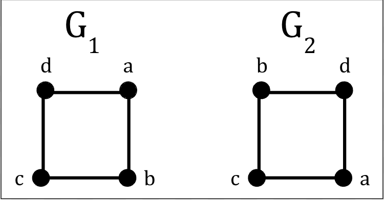
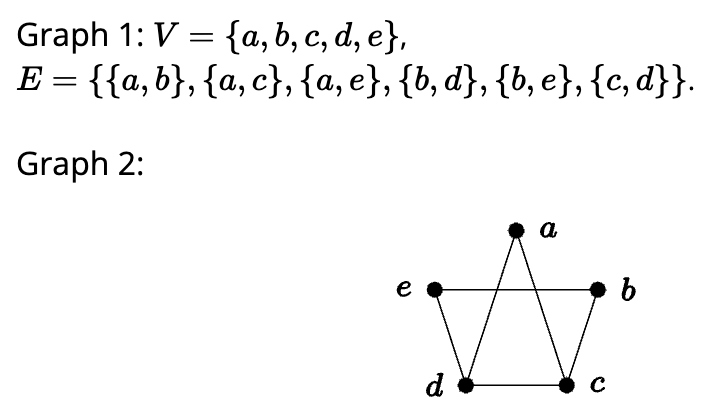
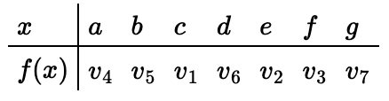
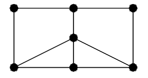

# Section 4.1 Exercises

## Problem 1

### If ten people each shake hands with each other, how many handshakes took place? What does this question have to do with graph theory?

The number of hands shooken would be $10 \choose 2 = 45$ handshakes. This is related to graph theory because it is similar to vertices that ementate line segements. If we used graph theory to solve this, it would be like having ten vertices, each with a degree of two. Vertex would be adjacent to nine other vertices, so adding up all those degrees and dividing by two gives us $\frac{10(10-1)}{2} = 45$ handshakes.

## Problem 2

### Among a group of 5 people, is it possible for everyone to be friends with exactly 2 of the people in the group? What about 3 of the people in the group?

This would be like a graph with 5 vertices that each have a degree of 2. This way, the degrees of the vertices would add up to 10. Because this is an even total, this graph is possible. The other 3 people in the group would represent 3 vertices that each segment is not adjacent to.

## Problem 3

### Is it possible for two *different* (non-isomorphic) graphs to have the same number of vertices and the same number of edges? What if the degrees of the vertices in the two graphs are the same (so both graphs have vertices with degrees 1, 2, 2, 3, and 4, for example)? Draw two such graphs or explain why not

The vertices and their degrees may be the same, but the specific vertices that each vertex is connected to, i.e. the vertex pairs in $E$, can be different. This is the case for the following two graphs:

Between $G_1$ and $G_2$, $V_1 \subseteq V_2$, but the same cannot be said about $E_1$ and $E_2$. Therefore, since both conditions weren't met, the graphs are non-isomorphic.

## Problem 4

### Are the two graphs below equal? Are they isomorphic? If they are isomorphic, give the isomorphism. If not, explain

The graphs are NOT isomorphic becaue the edge $\{a,b\}$, which exists in $G_1$, does not also exist in $G_2$. Therefore, $E_1$ is not in $E_2$, and the graphs are not isomorphic.

## Problem 5

### Consider the following two graphs

$$
\begin{align*}
G_1 &: \\
V_1 &= \{a,b,c,d,e,f,g\} \\
E_1 &= \{\{a,b\},\{a,d\},\{b,c\},\{b,d\},\{b,e\},\{b,f\},\{c,g\},\{d,e\}\text{,}\{e,f\},\{f,g\}\}\text{.}
\end{align*}
$$

$$
\begin{align*}
G_2 &: \\
V_2 &= \{v_1,v_2,v_3,v_4,v_5,v_6,v_7\}\text{,} \\
E_2 &= \{\{v_1,v_4\},\{v_1,v_5\},\{v_1,v_7\},\{v_2,v_3\},\{v_2,v_6\}\text{,}\{v_3,v_5\},\{v_3,v_7\},\{v_4,v_5\},\{v_5,v_6\},\{v_5,v_7\}\}
\end{align*}
$$

#### Part (5a)

Let $f:G_1 \rightarrow G_2$ be a function that takes the verties of Graph 1 to the vertices of Graph 2. The fumctiom is given by the following table:

Does $f$ define an isomorphism betweeen Graph 1 and Graph 2?

For two graphs to be isomorphic, every vertex in one graph has to map to exactly one in the other graph, and any pair of vertices in one graph should map out to the same pair in the other. However, this is not true for this case. $E_1$ contains the edge $\{a,d\}$, which should ideally map out to $\{v_4,v_6\}$ in $E_2$. But since this edge does not exist in $E_2$ at all, there is no isomorphism.

#### Part (5b)

Define a new function $g$ (with $g \ne f$) that defines an isomorphism between Graph 1 and Graph 2.

| $x$      | $f(x)$ |
| ----------- | ----------- |
| a   | $v_4$       |
| b   | $v_5$        |
| c   | $v_6$        |
| d   | $v_7$        |
| e   | $v_3$        |
| f   | $v_2$        |
| g   | $v_1$        |

#### Part (5c)

Is the graph pictured below isomorphic to Graph 1 and Graph 2? Explain.

This graph has seven vertices, so it is possible that they map out to the vertices in $G_1$ and $G_2$. However, if all the edges are also the same, then that means that each vertex in this graph should also have the same degree as those in $G_1$ and $G_2$, which is not true. The vertex $b$ in $G_1$ and $v_5$ in $G_2$ have a degree of five, and there is no vertex with such degree in the graph shown above. Therefore, that graph is not isomorphic.

## Problem 6

### What is the largest number of edges possible in a graph with 10 vertices? What is the largest number of edges possible in a bipartite graph with 10 vertices? What is the largest number of edges possible in a tree with 10 vertices?

In a graph with 10 vertices, the largest number of edges possible is $10 \choose 2 = 45$ edges. A bipartite graph, however, would have two sets of 5 edges, each with all the possible vertices drawn between them. This gives us $10 \choose 2 \cdot 2 = 10 \cdot 2 = 20$.
