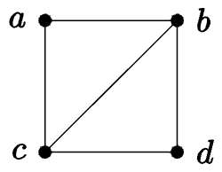
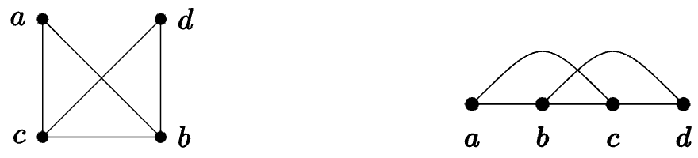
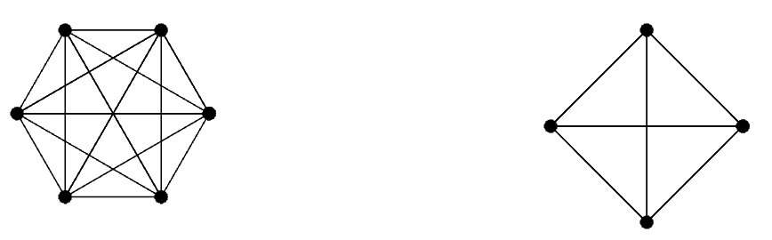
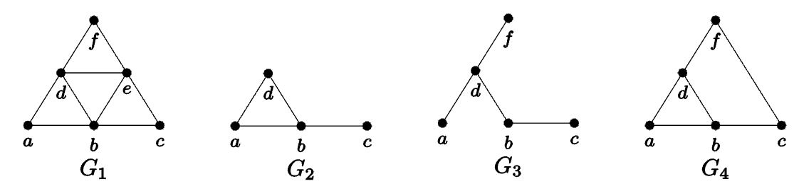
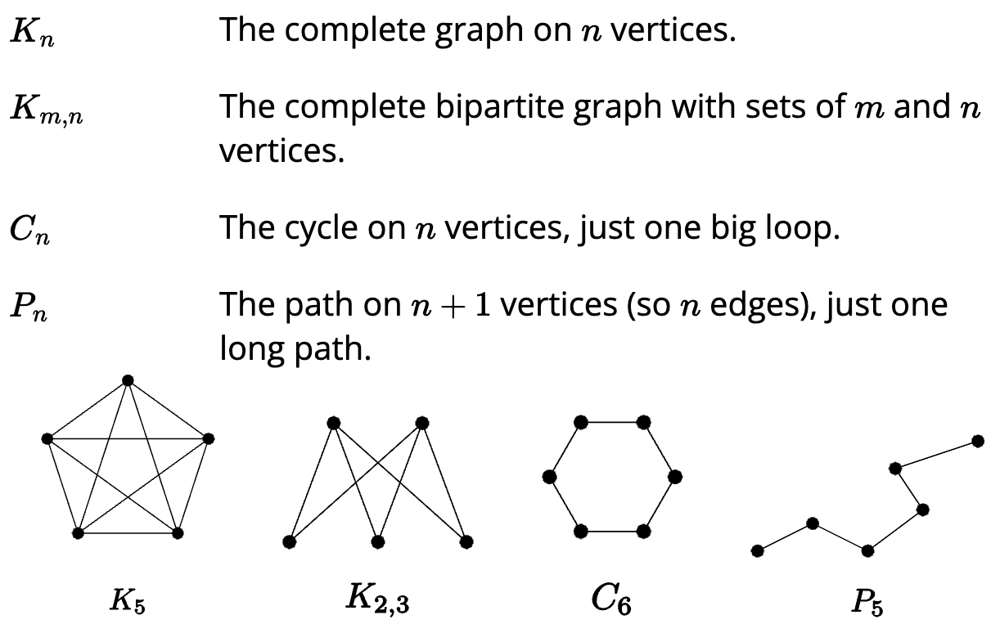
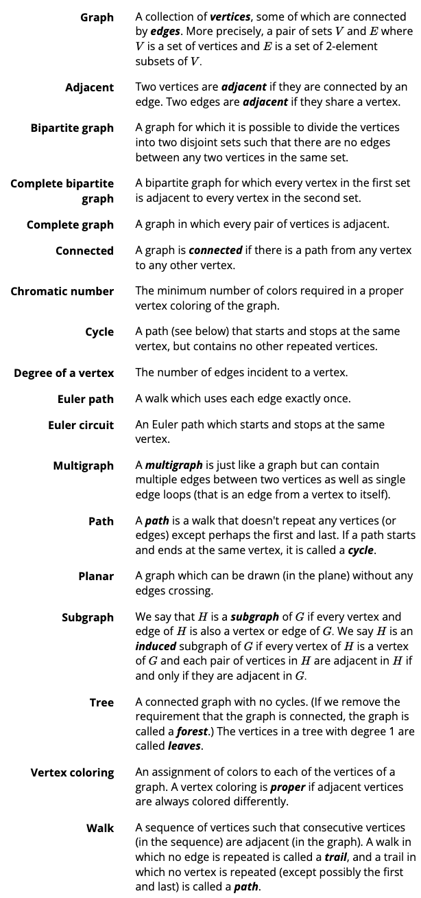

# 4.1 Definitions

## What is a graph?

A **graph** is an ordered pair $G = (V,E)$ consisting of a nonempty set $V$ (called **vertices**) and a set $E$ (called the **edges**) of two-element subsets of $V$.

There are no dots or lines involved in the definition, so that means that the following could be a graph:

$$
(\{a,b,c,d\},\{\{a,b\},\{a,c\},\{b,c\},\{b,d\},\{c,d\}\})
$$

In this example, $V$, the set of vertices of the graph, is $\{a,b,c,d\}$ and $E$, the set of two-element subsets of $V$, is $\{\{a,b\},\{a,c\},\{b,c\},\{b,d\},\{c,d\}\}$.

Now, if we take this ordered pair, put down all the vertices and connect precisely the ones that share an ordered pair, we get the following:

However, there are other ways to do this, as well:

## Isomorphic Graphs

If the vertices and subsets in a graph can be arranged in any way, there must be some way of telling that two graphs are "the same." This is through a property called **isomorphism**.

An **isomorphism** between two graphs $G_1$ and $G_2$ is a bijection $f: V_1 \implies V_2$ between the vertices of the graphs such that $\{a,b\}$ is an edge in $G_1$ if and only if $\{f(a),f(b)\}$ is an edge $G_2$.

Two graphs are **isomorphic** if there is an isomorphism between them. In this case we write $G_1 \cong G_2$.

A collection of isomorphic graphs is called an **isomorphism class**.

## Subgraphs

Look at the following two graphs:

Although the graphs are not isomorphic, the graph on the right looks like it's part of the graph on the left. In other words, the graph on the right is a **subgraph** of the graph on the left.

We say that $G' = (V',E')$ is a **subgraph** of $G = (V,E)$, and write $G' \subseteq G$, provided $V' \subseteq V$ and $E' \subseteq E$.

### Induced Subgraphs

We say that $G' = (V',E')$ is an **induced subgraph** of $G = (V,E)$ provided $V' \subseteq V$ and every edge in $E$ whose vertices are still in $V'$ is also an edge in $E'$.

A subgraph is essentially the result of deleting some edges and vertices from the original graph. An induced subgraph, on the other hand, is different because after you delete some vertices, you only delete the edges that *contained* those vertices.

For example, take a look at this image:

Both $G_2$ and $G_3$ are subgraphs of $G_1$. Only $G_2$, however, is an *induced subgraph*. This is because $V_2 = \{a,b,c,d\}$, and $V_2 \subseteq V_1$, and all the edges between the vertices $\{a,b,c,d\}$ in $G_1$ are also identically seen in $G_2$.

$G_3$, on the other hand, is NOT an induced subgraph, because although it shares vertices $a$ and $b$ with $G_1$, it does not have an edge between those exact vertices.

$G_4$, however, is not a subgraph at all. It contains the edge $\{c,f\}$, which does not exist in $G_1$ because of the vertex $e$. Therefore, we don't have the required $E_4 \subseteq E_1$ to make it a subgraph.

## Handshake Lemma

Vertices in a graph need not have edges between them. A graph with all possible edges that can be drawn between the vertices is called a **complete graph**. There is only one complete graph for a given number of veritices. We call this graph $K_n$ for a graph on $n$ vertices.

Each vertex in $K_n$ is adjacent to $n - 1$ other vertices. We call the number of vertices emanating from a vertex the **degree** of the vertex. If there are $n$ vertices, each with a degree of $n - 1$, then the number of edges is $\frac{n(n - 1)}{2}$ (we divide by two to avoid counting each edge twice). In other words, there are $n \choose 2$ edges.

The sum of the degrees of all the vertices in a graph is always twice the number of edges in the graph, because each degree counts for the edge that connects two vertices. Therefore, the sum of the degrees is alway even.

### Lemma 4.1.5. Handshake Lemma

*In any graph, the sum of the degrees of vertices in the graph is always twice the number of edges.*

This is also called the *degree sum formula*. Here it is in symbols:

$$
\sum_{v \in V}^{}d(v) = 2e
$$

Where $d(v)$ represents the degree of a vertex in the graph.

## Proposition 4.1.8

*In any graph, the number of vertices with an odd degree must be even.*

## Bipartite graphs

A graph is **bipartite** if the vertices can be divided into two sets, $A$ and $B$, with no two vertices in $A$ ajacent and no two vertices in $B$ adjacent.

If each vertex in $A$ is adjacent to all the vertices in $B$, then the graph is a **complete bipartite graph, and gets a special name: $K_{m,n}$, where $|A| = m$ and $|B| = n$.

## Named Graphs

Some graphs are used often enough to recieve their own names:

## Glossary of terms for section 4

