# 4.3 Planar Graphs

## Introduction

A **planar graph** is any graph that is possible to redraw with none of the edges overlapping. It is as if all the edges are on one "plane."

Here's an example of a planar graph:

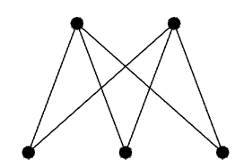

It has overlapping edges, but it can be redrawn in a way that it doesn't:

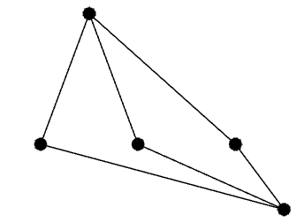

This second graph is simply a **planar representation** of the first one.

## Faces

When the planar representation of a graph is drawn, the edges and vertices divide the plane into multiple regions, each of which is called a **face**. You can only count faces on a planar representation!

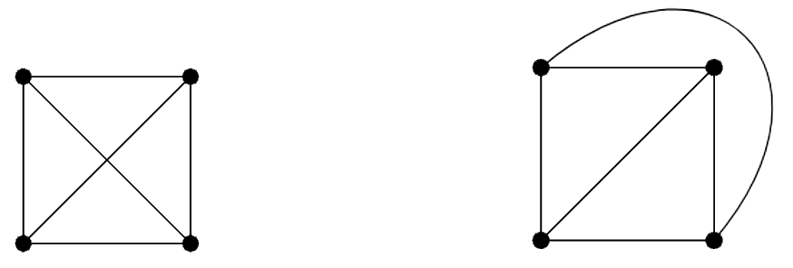

If you try to count the faces on the graph that is on the left, you'll see there are 5 (if you count the area outside the square as a face). However, if you draw the planar representation of the graph, you would see that there are only 4 faces.

## Euler's Formula for Planar Graphs

For any connected planar graph with $v$ vertices, $e$ edges and $f$ faces, we have:

$$
v - e + f = 2
$$

We can prove this formula. Imagine the following graph $P_2$:

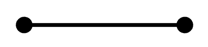

One by one, we can start to add vertices and edges to this graph:

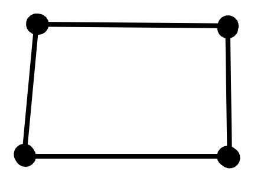

Each time we add to the graph, we can do one of two things: either we can add one vertex with an edge connecting it to the graph (left) OR we can add an edge between two existing vertices (right):

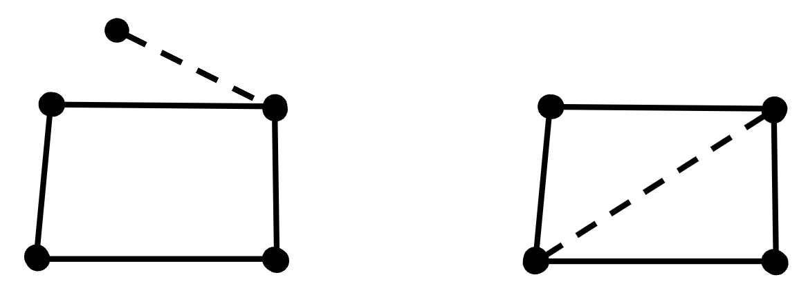

Let's look at each of these "moves" from a mathematical perspective:

Adding one vertex with an edge connecting it to the graph increases the number of vertices ($v$) by one and increases the number of edges ($e$) by one. We can plug this into Euler's formula to get the following:

$$
v - e + f = 2 \\
(v + 1) - (e + 1) + f = 2 \\
v + 1 - e - 1 + f = 2 \\
v - e + f = 2 \\
$$

The formula is still true.

Adding an edge between two existing vertices increases the number of faces ($f$) by one and increases the number of edges ($e$) by one. We can plug this into Euler's formula to get the following:

$$
v - e + f = 2 \\
v - (e + 1) + (f + 1) = 2 \\
v - e - 1 + f + 1 = 2 \\
v - e + f = 2 \\
$$

The formula is still true.

Therefore, Euler's formula will always hold true for a planar graph.

## Maximum Planar Graphs

A planar graph is called **maximum planar** if adding an edge between any two non-adjacent vertices results in a non-planar graph.

Take this graph for example:

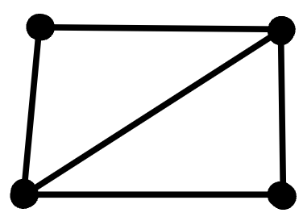

If we draw an edge between the only two vertices that aren't connected (i.e. the top left and top right ones), that edge will overlap with the other, thus making the graph non-planar.

Also note that every face of the planar graph is a triangle.

### Theorem for Maximum Planar Graphs

If the graph $G$ is a planar graph with $e$ edges and $v$ vertices, we have the following:

$$
e = 3v - 6
$$

We can prove this. Let's say we have a planar graph $G$ with $f$ faces. Each of the faces is a triangle; therefore, we can sum up the edges of all these faces to get a total of $3f$ edges. However, becuase edges share faces, this counts each edge twice. Therefore, $3f = 2e$, and $f = \frac{2e}{3}$. We can substitute this into the original formula for planar graphs:

$$
v - e + f = 2 \\
v - e + \frac{2e}{3} = 2 \\
3v - 3e + 2e = 6 \\
3v - e = 6 \\
e = 3v - 6 \\
$$

### Corollary

If the graph $G$ is a planar graph with $e$ edges and $v$ vertices, then $e \le 3v - 6$.

This makes sense, because $3v - 6$ is the number of edges for a *maximum* planar graph; there can be fewer edges.

## Non-planar Graphs

Some graphs are not planar and can never be planar. For example, **$K_5$ is not planar.**

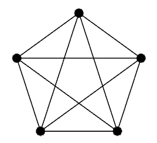

We can prove this using proof by contradiction:

> Let's say $K_5$ is planar. If it is, it must satisfy the theorem for planar graphs: that a planar graph with $v$ vertices would have at most $3v - 6$ edges. $K_5$ has 5 vertices and ${5 \choose 2} = 10$ edges. We can plug this into the formula:
>
> $3(5) - 6 \ge 10 \\$
> $15 - 6 \ge 10 \\$
> $9 \ge 10 \\$
>
> A planar graph with 5 edges should have a maximum of only 9 edges, but $K_5$ has 10. That is impossible. Therefore, we have a proof by contradiction.

In addition to $K_5$, $K_{3,3}$ is *also* not planar.

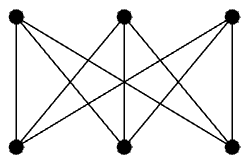

We can prove this using proof by contradiction:

> Let's say that $K_{3,3}$ is planar. If it is, then because $e = 9$ and $v = 6$. Because $v - e + f = 2$, $f = 5$.
>
> Next, let $B$ be the number of edges surrounding those 5 faces. Since each edge is used twice by a face, $B = 2e$. Also, because $K_{3,3}$ is bipartite, 3-edge cycles are impossible and therefore each face must be surrounded by at least 4 edges. In other words, $B \ge 4f$. Subbing in $2e$ for $B$ gives us $2e \ge 4f$.
>
> But this would mean saying that $18 \ge 20$, which is not true. Therefore, we have a proof by contradiction.

## Polyhedra

A **polyhedron** is a geometric solid made up of flat polygonal faces jointed at edges and vertices.

A **convex polyhedron** is a polyhedron in which any line segment connecting two points of the interior of the polyhedron should be on its interior.

Take a cube for example. Let's say we take that cube, put it on a table, and smash it flat. The bottom of the cube would spread out. We can depict this in a graph:

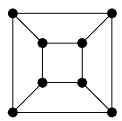

Note that this grave has 8 vertices, 12 edges and 6 faces, and that $8 - 12 + 6 = 2$. This is not a coincidence: **everything we know about graphs, specifically planar graphs, can be applied to polyhedrons**.

### Regular Polyhedra

A **regular polyhedron** is a polyhedron in which all the faces are identical polygons. In such graphs, each vertex has the same degree.

Only 5 regular polyhedra can exist, a statement we can prove with graph theory and proof by cases:

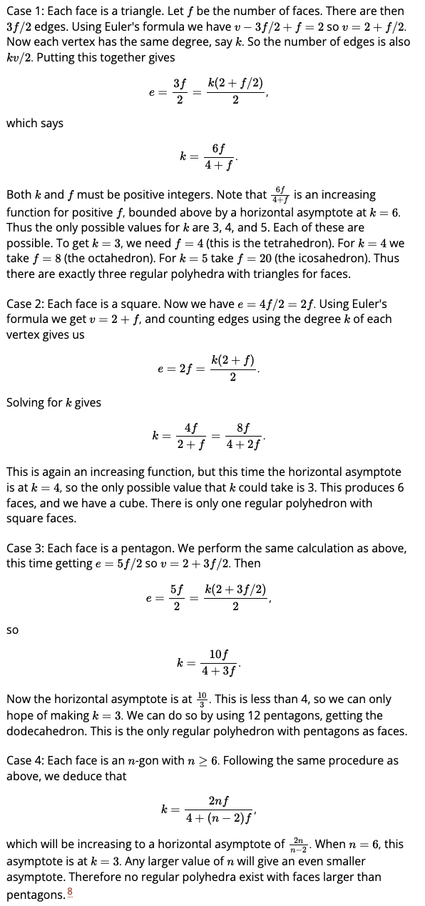

## References

1. [Graph Theory: 59. Maximal Planar Graphs by Sarada Herke](https://youtu.be/_d_6JvceAwE?list=PLGxuz-nmYlQPgIHbqWtgD-F7NnJuqs4fH)
2. [Maximal planar graphs by The City University of New York](http://people.qc.cuny.edu/faculty/christopher.hanusa/courses/pages/634fa09/notes/ch8-2.pdf)
3. [Graph Theory: 60. Non Planar Graphs by Sarada Herke](https://www.youtube.com/watch?v=-m6Dq7v9ToM)
4. [4.3 Planar Graphs from Discrete Mathematics: An Open Introduction, 3rd edition, By Oscar Levin](https://discrete.openmathbooks.org/dmoi3/sec_planar.html)
5. [Graph Theory 5: Polyhedra, Planar Graphs, & F-E+V=2 by Math at Andrews University](https://youtu.be/qCDZ5azvmrk)

[4.3 Problems](sect4.3.md)

## Problem 1

### Is it possible for a planar graph to have 6 vertices, 10 edges and 5 faces? Explain

> In this case, $v = 6$, $e = 10$ and $f = 5$. According to Euler's theorem, $v - e + f = 2$. $6 - 10 + 5 = 1 \ne 2$, therefore it is impossible for a planar graph to have 6 vertices, 10 edges and 5 faces.

## Problem 2

### The graph $G$ has 6 vertices with degrees $2, 2, 3, 4, 4, 5$. How many edges does $G$ have? Could $G$ be planar? If so, how many faces would it have. If not, explain

> $v = 6$ and $e = \frac{2 + 2 + 3 + 4 + 4 + 5}{2} = \frac{20}{2} = 10$. According to Euler's theorem, $e \le 3v - 6$. $3(6) - 6 = 12$, and $10 < 12$. Therefore, this graph can, indeed, be planar. If it was, because $v - e + f = 2$, we can solve for the edges:
>
> $6 - 10 + f = 2$
> $f - 4 = 2$
> $f = 6$
>
> Therefore, such a planar graph would have 6 faces.

## Problem 3

### Is it possible for a connected graph with 7 vertices and 10 edges to be drawn so that no edges cross and create 4 faces? Explain

> For the graph to be planar with $v = 7$ and $e = 10$, It has to satisfy $e \le 3v - 6$. $3v - 6 = 3(7) - 6 = 15$, and $10 < 15$. Therefore, this graph can be planar.
>
> Furthermore, we can solve for the number of faces:
>
> $v - e + f = 2$
> $7 - 10 + f = 2$
> $f - 3 = 2$
> $f = 5$
>
> A graph with 7 vertices and 10 edges drawn as a planar graph must have 5 faces. Therefore, it is impossible to draw it with only 4 and for it to be planar and connected at the same time.

[Dane will now cover problems 4, 5 and 6.](https://github.com/dane16/csc208/blob/main/Chap4prob5-7.md)

## Chapter 4 Problems 4-6

### Problem 4

Is it possible for a graph with 10 vertices and edges to be a connected planar graph? Explain.

It is possible for a graph with 10 vertices and edges to be a connected planar graph, while I wont be using a specific graph, I will explain why this would work.
Since the Euler's forumula for planar graph is v - e + f = 2, we can subsitute the values 10 for both the vertices and edges as given, we get the equation 10- 10 + F = 2
from this, solving this we get F = 2. This proves how a connected planar graph with 10 vertices and 10 edges must have 2 faces.

### Problem 5

Is there a connected planar graph with an odd number of faces where every vertex has degree 6.

It is not possible for this to occur, we start proving this by determining a relation between the degrees and edges, applying the handshake lemma this will get us 6V = 2E
(According to the handshake lemma, this total degree is also equal to twice the number of edges)
From this we conclude that E = 6V/2 which equals E = 3V. Subsitutuing this value in into Euler's formula gives us V - (3V) + F = 2 resulting in -2V + F = 2.
Considering that F is odd, we can now make the question -2V + (Odd Number) = (Even Number) 2, this shows how this is not possible as a odd number minus an even (twice the number of vertices)
number cannot result in another even number.

### Problem 6

I'm thinking of a polyhedron containing 12 faces. Seven are triangles and four are quadralaterals. The polyhedron has 11 vertices including those around the mystery face.
How many sides does the last face have?

(Refrencing Jeff's example) First we find the total number of edges, whuch would be (7 x 3 + 4 x 4 + n)/2 = (37 + n)/2. Knowing that the last face must have a odd number of edges.
v = 11 is given, so applying Eulers forumla would result in the equation 11 - (37 + n)/2 + 12 = 2 which results in n = 5, meaning the last face is a pentagon.

### Adonis's Repo

[https://github.com/Donworks/csc208/blob/main/Questions%207%2C%208%2C%209.md](https://github.com/Donworks/csc208/blob/main/Questions%207%2C%208%2C%209.md)

## Question 7

An octahedron is a regular polyhedron made up of 8 equilateral triangles (it sort of looks like two pyramids with their bases glued together). Draw a planar graph representation of an octahedron. How many vertices, edges and faces does an octahedron (and your graph) have?

A. Well I cant draw digitaly but they say that an octahedron is a polyhedron with 8 triangles like like two pyramids with the bottoms stuck togethere so it looks sort of like daimond you have about 6 vertecies and counting 4 points in the middle
and then there are 2 extra points one at the bottom and one at the top when counting the edges we have about 12 edges 4 edges leading to the middle point at the top from each point and the 4 connecting those middle points. Then the four edges leading to the bottom middle point
so that 12 edges we can use this information to find out wether its planar graph or not we can use Eulers formula v−e+f=2

B. The traditional design of a soccer ball is in fact a (spherical projection of a) truncated icosahedron. This consists of 12 regular pentagons and 20 regular hexagons. No two pentagons are adjacent (so the edges of each pentagon are shared only by hexagons). How many vertices, edges, and faces does a truncated icosahedron have? Explain how you arrived at your answers. Bonus: draw the planar graph representation of the truncated icosahedron.
 Ok im not gonna lie kinda confused on this one but if we have 12 pentagons which have 5 edges and 5 vertecies and there are 12 of them then we must have a set within pentagons that have 60 edges and 60 vertecies. because there are 5 points and 5 edges the same would go for a hexagon there are 6 points and 6 edges and there are 20 of them so 20 * 6 is 120 edges nd vertecies we can add this up

- We have about 180 edges but for every two hexagons joins with one black pentagon so we would divide this by two and we would get 90 $180/2 =90$
- We also have 32 faces because we have 12 pentagons and 20 hexagons and $12 + 20 = 32$
- We could use this information to find the amount of vertecies using Eulers equation $v-e + f = 2 -> v - 90 + 32 =2 2-32 = -30$ then $90-30 = 60 = v$
   

C. Your “friend” claims that he has constructed a convex polyhedron out of 2 triangles, 2 squares, 6 pentagons and 5 octagons. Prove that your friend is lying. Hint: each vertex of a convex polyhedron must border at least three faces.

- In the beginning we see that there are a certain amount of shpes with a certain amount of edges also we can get the amount of faces by counting the amount of shapes so $2+2+6= 10+5 =15$ there are about 15 faces
- then there are edges so there a 3 edges on triangle and there are two triangles $2 * 3 = 6$, squares $2 * 4 = 8$, pentagons $6 * 5 = 30$, octagons $5 * 8 = 40$ so in the end when we add up all the edges $6+8+30+40 = 84$
- Earlier we were given the hint each vertex of a convex Polyhedron must border adleast three faces well $84/3$ is not even in there is no such thing as a half edge

## Question 8

Prove Euler's formula using induction on the number of edges in the graph.

- Eulers formula is v-e +f =2
- $P(n)$ for every connected planar graph containing n edges satisfies eulers formula $v-n +f = 2$
- a simple case for this would be $v=1$, $f=1$, $e=0$
- Now we can make an inductiove case where k must be greater then or equal to zero however random it is. Now let consider an arbritrary graph that contaisn (k+1) edges and vertecies and faces. Now no matter how the graph is we should be able to remove an edge and get k edges which can be applied to the inductive hypothesis
- There are two types of cases there is a cyle and then there is no cycle which is called a tree

- - with a cycle you should have different edges which you can choose from to remove but by removing this edge you also decrease the amount of faces that you have. by doing this doesnt mean th egraph disconnects
    by inductive hypthesis when removing an edge you get $v-k +f -1=2$ but we can add back that edge too and that would be $v-(k+1) +f = 2$

  - The second case goes the if there is no cycle then the vertex can be a degree 1 and by removing vertex incidently you can  make it a degree one also the smaller the graph the more it complies with Eulers formula.
  - also this does not remove any faces when your remove an edge, so removing is $v-1-k +f =2$ and when adding one back it becomes $v-(k+1) +f =$

## for question nine

- would some what go the same except we focus on vertecies removing a point which would then remove an edge so then it would be somewhat like $v-k -1 +f=2$ and then adding one back would be along the line of $(V+1)-(k+1) +f=2$

## Questions 10, 11, and 12

### **10.** Euler's formula $(v - e + f = 2)$ holds for all connected planar graphs

### What if a graph is not connected? Suppose a planar graph has two components

### What is the value of $v - e + f$ now? What if it has $k$ components?

- In a case that a graph is not connected e.g. A triangle and A line segment.
That would have 5 vertices, 4 edges, and 2 faces which leads us to 5 - 4 + 2 = 2 which is false.
if the two were connected we can see that the count of vertices decreases telling us the action of separation causes an added vertice without the balanced increase in edges.

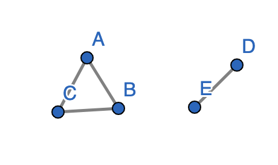

$$v - e + f = k + 1$$

This is because adding a face adds a vertice without adding an edge increasing the total.
If you have one face it would just be 1 + 1 as k would be 1.

***

### **11.** Prove that the Petersen graph (below) is not planar

### Hint: What is the length of the shortest cycle? (This quantity is usually called the girth of the graph.)

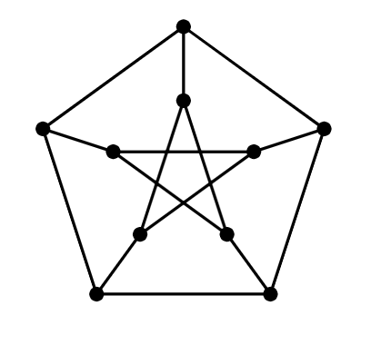

- The shortest cycle is 5

- any planar graph must acomplish $e \le 3v - 6\text{.}$
 $$15 \le 3(10)-6\text{.}$$

 $$15 \le 14$$
***

### **12.** Prove that any planar graph with $v$ vertices and $e$ edges satisfies  $e \le 3v - 6\text{.}$

Proof. We know in any planar graph the number of faces $f$ satisfies $3f \le 2e$ since each face is bounded by at least three edges, but each edge borders two faces. Combine this with Euler's formula:

$v - e + f = 2$

$3f \le 2e$

$\dfrac{2e}{3} \geq f$

$v - e + \dfrac{2e}{3} \geq 2$

$3v - e \geq 6$

$e \le 3v - 6\text{.}$

## Problem 13

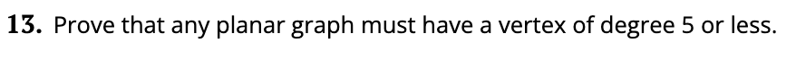

- The sum of the degrees of all the vertices equals 2 times the number of edges. In a graph with all vertices being of >6 degrees, the minimum $\Sigma$ deg(v) can be is 6v.
- 2e = $\Sigma$ deg(v) >= 6v
- 2e >= 6v
- e>=3v
- However, this contradicts the e<=3v-6 theorem for planar graphs,
since 3v-6>=3v cannot be true, therefor a planar graph must have a degree of 5 or less.

## Problem 14

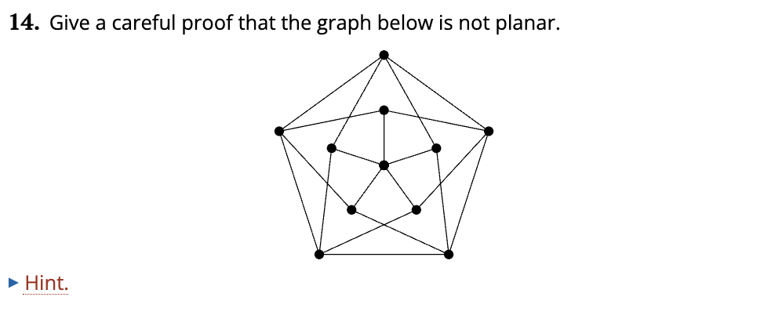

- Let's assume this is a planar graph, so v-e+f=2 must be true for the graph. This graph has 11 vertices, 20 edges so 11-20+f=2 so f = 11, thus this graph has 11 faces.

- This graph has a girth of 4. Since in a planar graph g*f<=2*e, 4f<=40, f<=10. But f=11, so this cannot be a planar graph.

- An additional way to immediately tell that this graph is not planar is that it visibly contains $K_5$ as a minor, which according to Kuratowski's theorem means it is not planar. [https://www.ams.org/journals/bull/2006-43-01/S0273-0979-05-01088-8/S0273-0979-05-01088-8.pdf](https://www.ams.org/journals/bull/2006-43-01/S0273-0979-05-01088-8/S0273-0979-05-01088-8.pdf)

## Problem 15

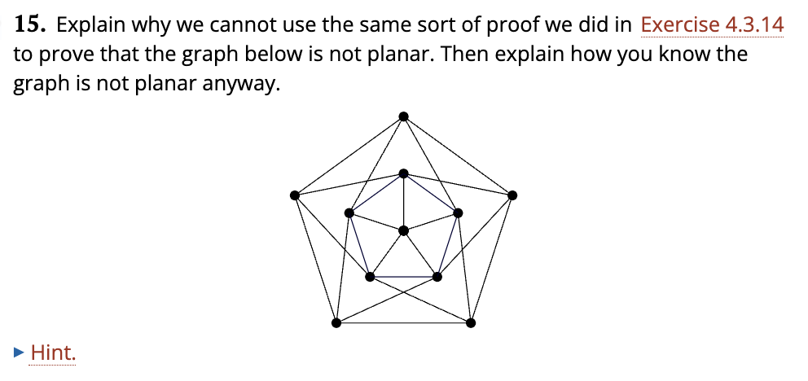

- Let's assume this is a planar graph, so v-e+f=2 must be true for the graph. This graph has 11 vertices, 25 edges so 11-20+f=2 so f = 11, so this graph has 16 faces.

- This graph now has a girth of 3. Since in a planar graph g*f<=2*e, 3f<=50, f<=16(2/3). And f=16, so we cannot come to the conclustion that this is not a planar graph just from this.

- This graph does contain the prevoius graph as a subgraph, however, and we know that graph is not planar, so we know that this graph is not planar.
